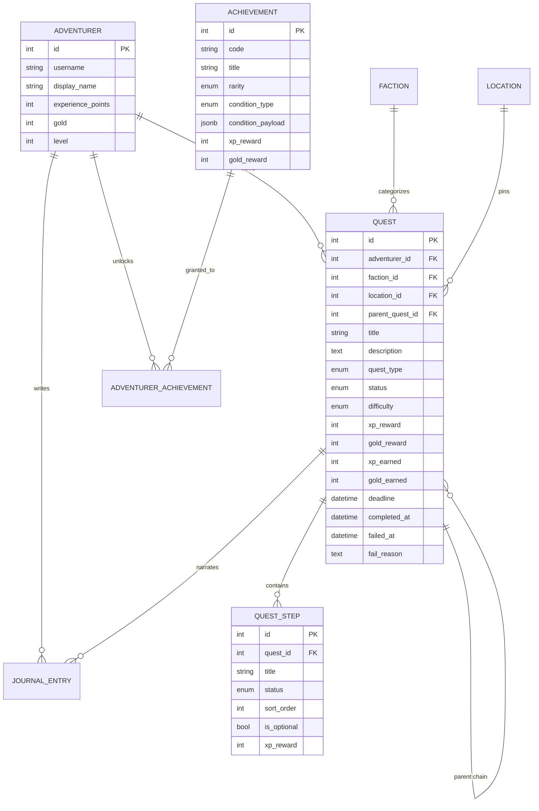

# QuestLog — схема данных

RPG-задачник: квесты, этапы, карта, дневник и достижения.

## ER-диаграмма



## Сущности

### Adventurer (искатель)

Профиль игрока. Накапливает **XP** и **золото** при завершении квестов.
**Уровень** хранится явно; пересчитывается сервисом при начислении опыта.

### Faction (фракция)

Категория квестов: «Работа», «Здоровье», «Дом». Используется в фильтрах дневника
и в достижениях вида «5 квестов фракции Здоровье».

### Location (локация)

Точка на карте: координаты, адрес, RPG-тип места (`tavern`, `dungeon`, `stronghold`…).
Квест может быть без локации — тогда он не попадает на карту.

### Quest (квест)

| Поле | Назначение |
|------|------------|
| `quest_type` | main / side / daily / bounty / exploration / boss |
| `status` | active / completed / failed / deferred / abandoned |
| `difficulty` | trivial → legendary, влияет на базовые награды |
| `xp_reward`, `gold_reward` | плановая награда при создании |
| `xp_earned`, `gold_earned` | фактически начислено (при провале может быть 0 или частично) |
| `deadline` | обязателен для типа `bounty`, опционален для остальных |
| `parent_quest_id` | цепочки квестов (главный квест → подквесты) |
| `fail_reason` | текст при статусе `failed` — остаётся в дневнике |

**Переходы статусов:**

```
active ──► completed
   │           │
   ├──► failed │
   ├──► deferred
   └──► abandoned
```

Проваленные квесты **не удаляются** — видны в дневнике с печатью «Провалено».

### QuestStep (этап)

Подзадача внутри квеста. Статусы: `pending`, `completed`, `skipped`.
Опциональные этапы (`is_optional`) не блокируют завершение квеста.
Частичный XP за этапы можно суммировать при завершении.

### Achievement (достижение)

Шаблон с условием (`condition_type` + `condition_payload` в JSONB).
Примеры payload:

```json
{"count": 10}
{"faction_slug": "health", "count": 5}
{"streak_days": 7}
```

Секретные достижения (`is_secret`) скрыты до разблокировки.

### JournalEntry (запись дневника)

Свободный текст: прогресс, итог, причина провала, лор от игрока.
Может быть привязана к квесту или существовать отдельно (`quest_id = null`).

## Типы квестов

| Тип | RPG-смысл | Особенности |
|-----|-----------|-------------|
| `main` | Главный сюжет | Высокие награды, может иметь дочерние квесты |
| `side` | Побочное | Стандартный квест |
| `daily` | Ежедневный ритуал | Сбрасывается / создаётся заново по расписанию (логика в сервисе) |
| `bounty` | Контракт | Ожидается `deadline`; провал по истечении срока |
| `exploration` | Исследование | Новая территория, часто с `location` |
| `boss` | Босс-файт | Высокая сложность, триггер достижений |

## Награды и экономика

1. При создании квеста задаются `xp_reward` и `gold_reward` (можно вычислять из `difficulty` + `quest_type`).
2. При `completed` сервис пишет `xp_earned` / `gold_earned`, прибавляет к Adventurer, проверяет level-up.
3. При `failed` награда обычно 0; допустим частичный XP за выполненные этапы — на усмотрение геймдизайна.
4. Достижения дают дополнительный XP/золото при разблокировке.

## Индексы

Квесты индексируются по `adventurer_id`, `status`, `quest_type`, `faction_id`, `location_id`, `deadline` —
для быстрых выборок «активные», «просроченные bounty», «квесты на карте».
