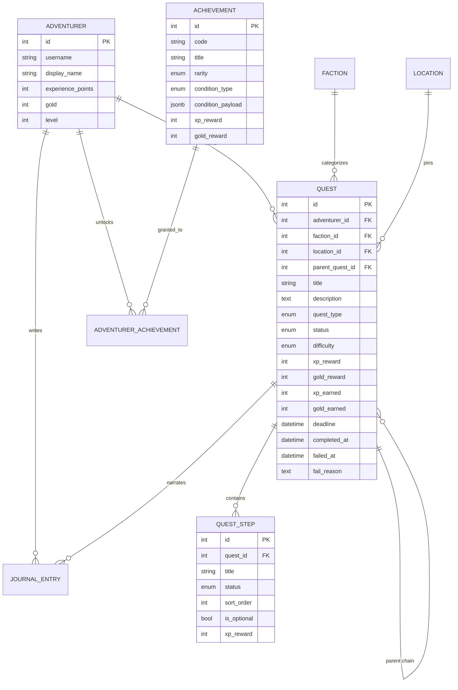

# ER-диаграмма

Связи между таблицами QuestLog. Подробности по сущностям — в отдельных страницах справочника.

## Диаграмма

## Навигация по сущностям

| Таблица | Wiki-страница |
|---------|---------------|
| `adventurers` | [[Adventurer]] |
| `quests` | [[Quest]] |
| `quest_steps` | [[QuestStep]] |
| `factions` | [[Faction]] |
| `locations` | [[Location]] |
| `achievements` | [[Achievement]] |
| `adventurer_achievements` | [[Achievement#AdventurerAchievement — факт разблокировки]] |
| `journal_entries` | [[JournalEntry]] |

## См. также

- [[QuestLog]] — оглавление справочника
- [[Economy]] — сквозная логика наград
